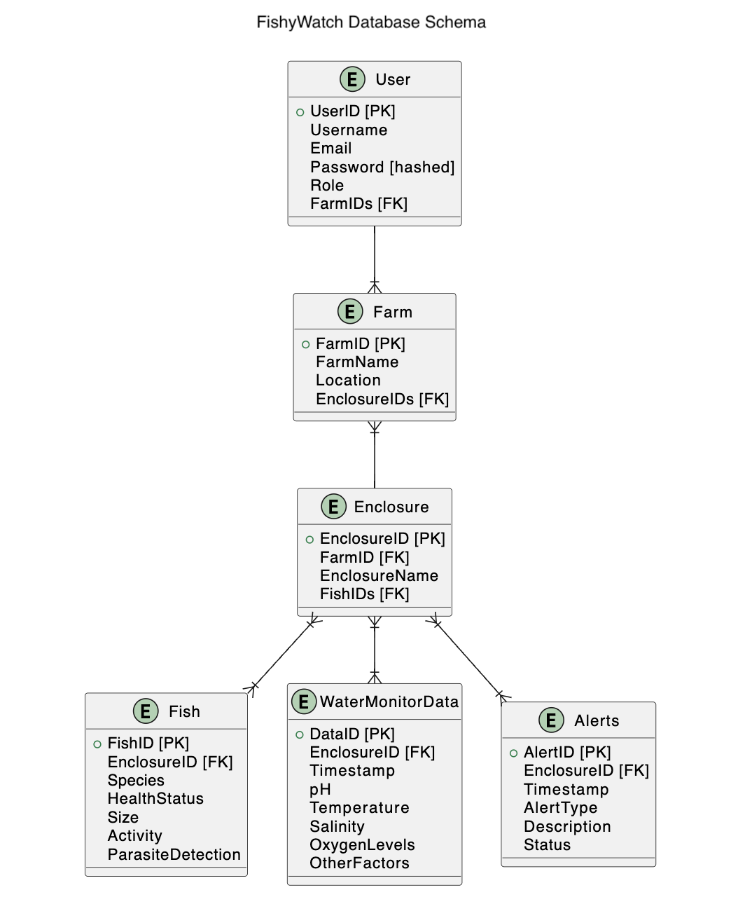

# ADR-003: Database Schema Design

## Date:
2024-04-03

## Status:
Accepted

## Context:
The context for this decision is to define the database schema, entities, and relationships for the Fishy Watch system. We need to model the data structure to efficiently store and retrieve information related to fish farms, water quality, fish health, alerts, and user profiles.

## Decision:
After analyzing the requirements and data relationships, we have designed the following database schema for Fishy Watch:

### Entities and Relationships:
1. **User**:
   - Attributes: UserID (Primary Key), Username, Email, Password (hashed), Role, FarmIDs (Foreign Key)
   - Relationships: One user can have multiple farms (One-to-Many with Farms)

2. **Farm**:
   - Attributes: FarmID (Primary Key), FarmName, Location, EnclosureIDs (Foreign Key)
   - Relationships: One farm can have multiple enclosures (One-to-Many with Enclosures), Belongs to one User (Many-to-One with User)

3. **Enclosure**:
   - Attributes: EnclosureID (Primary Key), FarmID (Foreign Key), EnclosureName, FishIDs (Foreign Key)
   - Relationships: One enclosure belongs to one farm (Many-to-One with Farm), One enclosure can have multiple fishes (One-to-Many with Fish)

4. **Fish**:
   - Attributes: FishID (Primary Key), EnclosureID (Foreign Key), Species, HealthStatus, Size, Activity, ParasiteDetection
   - Relationships: One fish belongs to one enclosure (Many-to-One with Enclosure)

5. **WaterMonitorData**:
   - Attributes: DataID (Primary Key), EnclosureID (Foreign Key), Timestamp, pH, Temperature, Salinity, OxygenLevels, OtherFactors
   - Relationships: One data record belongs to one enclosure (Many-to-One with Enclosure)

6. **Alerts**:
   - Attributes: AlertID (Primary Key), EnclosureID (Foreign Key), Timestamp, AlertType, Description, Status
   - Relationships: One alert is associated with one enclosure (Many-to-One with Enclosure)

### Database Schema:

## Consequences:
### Pros:
- Clear Data Model: The designed schema provides a clear understanding of entities, attributes, and relationships in the Fishy Watch system.
- Data Integrity: Foreign key constraints and entity relationships ensure data integrity and consistency.
- Scalability: The schema is designed to accommodate growth and scalability, supporting multiple farms, enclosures, fishes, and data records.
- Efficient Queries: Optimized database design facilitates efficient querying and data retrieval operations.

### Cons:
- Complexity: Managing relationships and ensuring data consistency may add complexity to database operations.
- Performance Considerations: Large volumes of data and complex queries may require performance tuning and optimization strategies.
