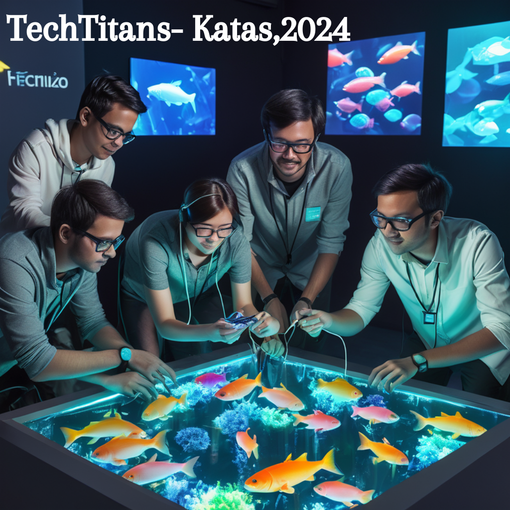
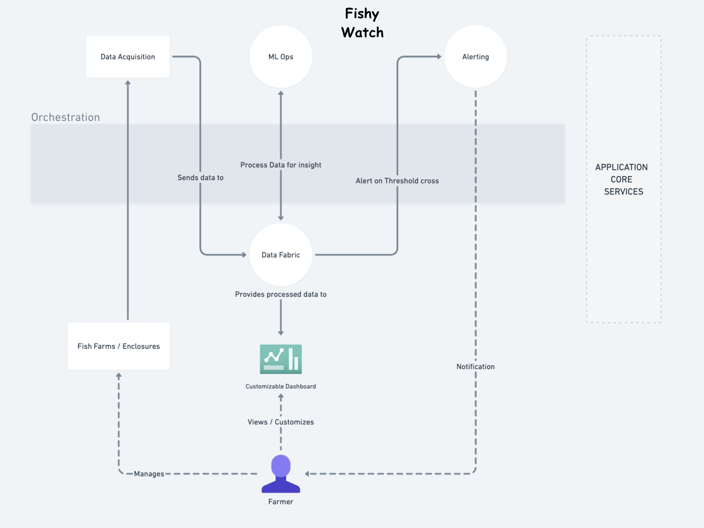
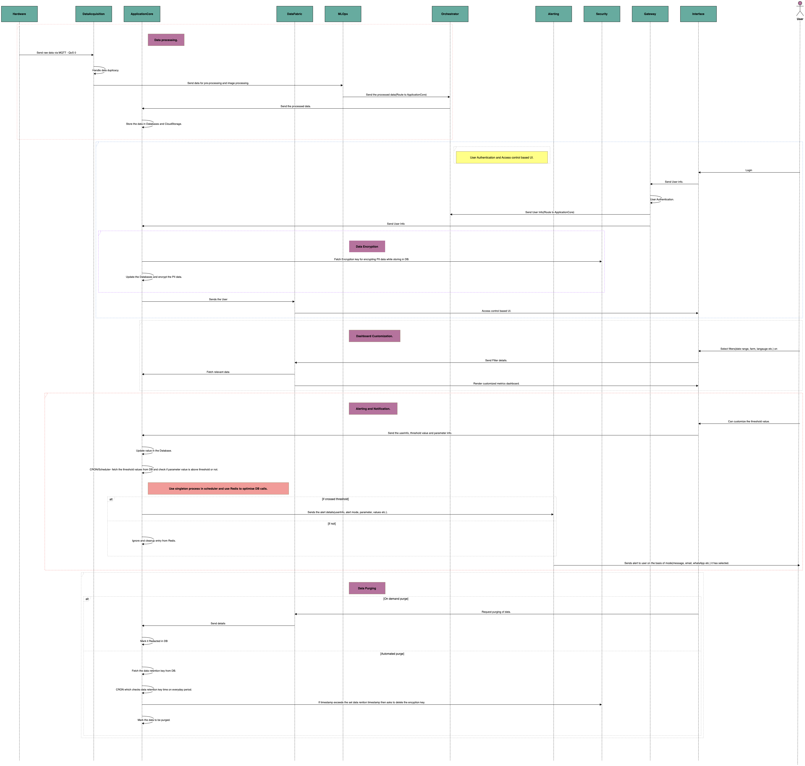
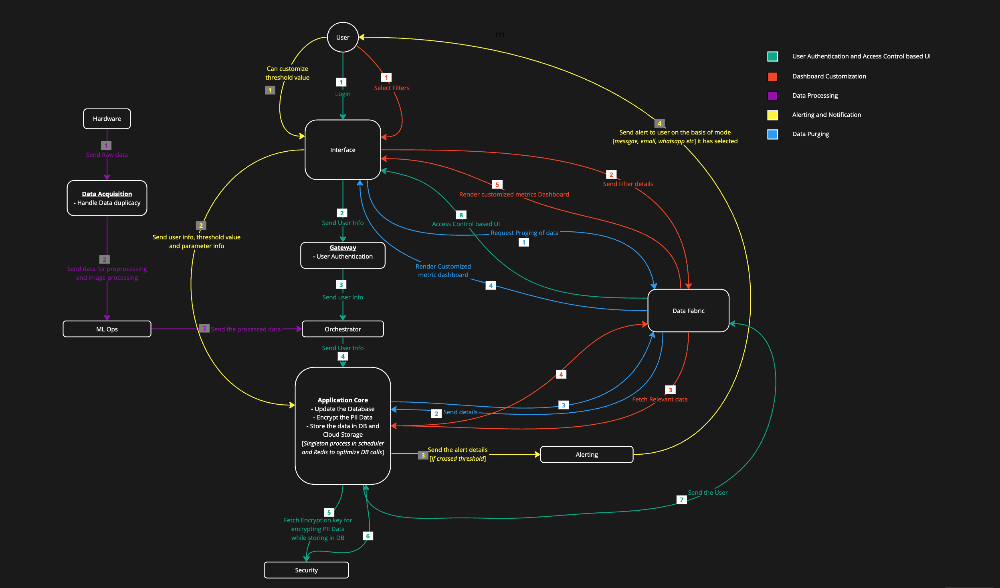
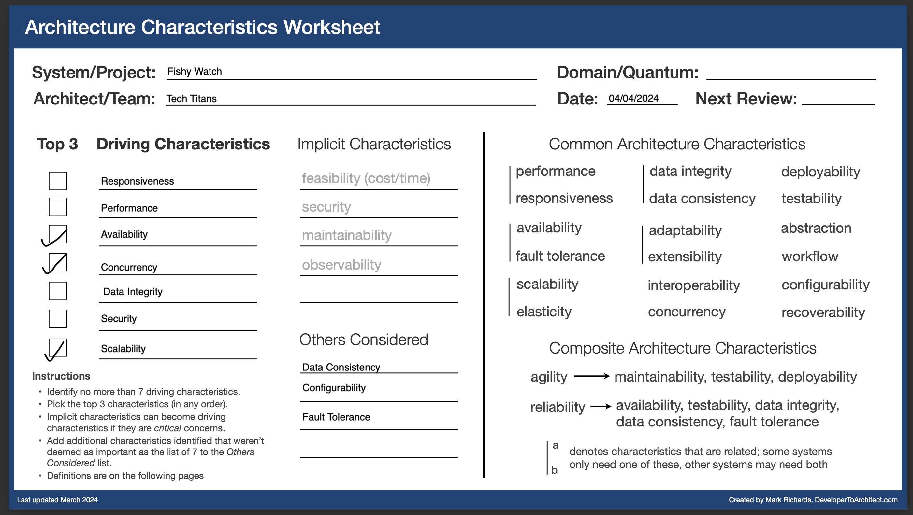
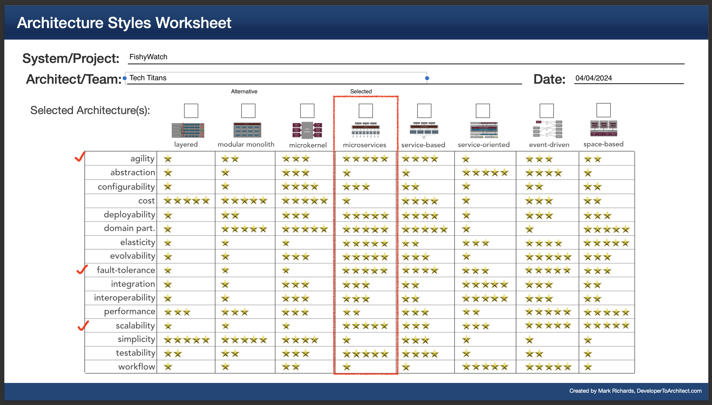
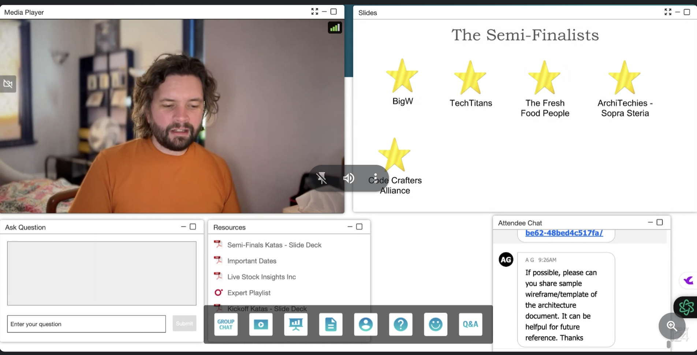
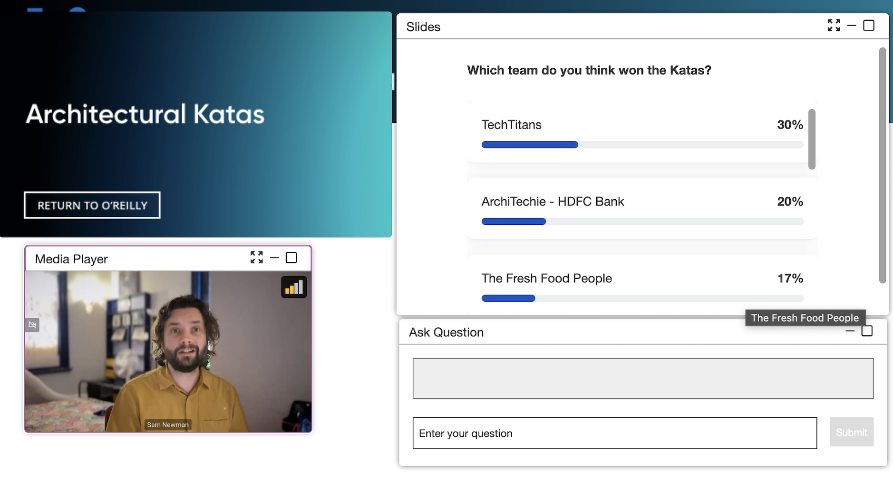

# TeamTechTitans-Katas2024

Team TechTitans Architectural Katas by O'Reilly, April 2024

Final video presentation: https://www.youtube.com/watch?v=MH5BAMARAEg

## Team Members:

- [***Manas Chaturvedi***](https://www.linkedin.com/in/manaschaturvedi2202/)
- [***Saransh Jain***](https://www.linkedin.com/in/saranshj9/)
- [***Shishir Kumar***](https://www.linkedin.com/in/shishir1995/)
- [***Greeva Shah***](https://www.linkedin.com/in/greevashah/)
- [***Sumeet Singh***](https://www.linkedin.com/in/sumeet-singh-724839133/)

---

# Fishy Watch

## Business Context
Livestock Insights Incorporated is a company headquartered in Scotland, but
operating globally.

Their main service offering, Fishy Watch, is used by Fish Farmers around the world to monitor their fish, and the fish farms in general
It is able to collect information about individual fish, water quality, and weather information.

Fish farmers use this information to understand the health of their livestock, check for signs of parasites and disease, and work out the best time to harvest.

## Business Requirements
| # | Description |
| ---- |-------------|
| BR1      | Customer Farm Management   - Customers may operate multiple fish farms in various geographical locations.   - Farms are divided into enclosures where fish are kept, ranging from a few to over a thousand enclosures per farm.   - Each enclosure is equipped with water monitors capturing data on pH, temperature, salinity, oxygen levels, and other factors.   - Underwater cameras provide general insights into fish health, monitoring size, activity, and parasite detection.    - reference - [ADR-001](ADRs/001-user-interfaces.md)|
| BR2      | Individual Fish Monitoring   - A beta feature allows individual fish identification through fish-ual recognition for health and lifecycle monitoring. |
| BR3 | Dashboard Customization   - Farmers require customizable dashboards to view collected information. |
| BR4 | Threshold-based Timely Alerts   - Farmers need to set thresholds for receiving alerts, ranging from basic parameters like pH levels to advanced warnings for adverse weather events.   - reference - [ADR-005](ADRs/005-alerting-metrics-and-thresholds.md)|
| BR5 | Data Aggregation   - Raw Data from multiple hardwares in multiple fish enclosures should be utilized to develop models predicting factors contributing to successful harvests.   - reference - [ADR-004](ADRs/004-data-acquisition-approach.md)|
| BR6 | Multi-species Support   - Farms may host various fish species.   - reference - [ADR-003](ADRs/003-database-schema-design.md) |
| BR7 | Worldwide Insights   - Large customers seek insights across multiple farms and multiple geographies. |
| BR8 | Continuous Improvement   - Expectation for a similar system for other livestock like cattles and support for new hardware devices. |

## Technical Requirements
| # | Description |
| ---- |-------------|
| TR1      | Connectivity in Remote Areas   - Considerations for remote fish farm locations with poor cellular signal. |
| TR2      | Data Transmission   - Define mechanisms for hardware devices to transmit collected data to the system. |
| TR3 | Device Accessibility   - Fishy Watch should be accessible from various devices, including rugged industrial devices used at sea during harvest. |
| TR4 | Future Scalability   - Architect the system to accommodate potential expansion into cattle monitoring and aquarium health management. |

## Target Audience

- **Fish Farmers**: Primarily, fish farmers who operate fish farms of various sizes and may have multiple farms in different geographical locations. Who may find this system useful for monitoring fish health and behavior.

- **Decision-makers and Executives**: Industrialists who own organization which have tie ups with multiple farm owners. They are responsible for making strategic decisions for large-scale industry wide farming operations.

- **Data Scientists and Analysts**: Professionals who analyze the collected data to derive insights and develop models for predicting factors contributing to successful harvests.
   
- **Researchers**: Professionals engaged in research related to aquaculture, fish health, and behavior.

- **Livestock Insights Inc. Support and Developers**: Individuals responsible for managing, maintaining, and developing the Fishy Watch system, including its software, hardware, and data infrastructure.

- **Regulatory Authorities**: Regulatory agencies overseeing aquaculture/livestock practices, who may use the system to monitor compliance and ensure the health and welfare of farmed fish.

## High Level Architecture
Below is the proposed high level architecture for implementing the Fishy Watch solution:

[Main Components/Systems](SoftwareSystems/)

## Sequence Diagram 
Below is the proposed sequence diagram for implementing the FishyWatch solution:

 

## Architecture Characteristics

| Architecture Characteristics  | Business Needs |
| ------------- | ------------- |
| Responsiveness | ***Fishy Watch*** must swiftly provide real-time data to farmers, ensuring they can promptly respond to any changes in fish health, water quality, or environmental conditions, thus optimizing farm management practices. |
| Performance | It should efficiently process and analyze large volumes of data collected from multiple farms and devices, ensuring that farmers can access insights without experiencing delays or performance issues. |
| Availability | Ensure uninterrupted access to ***Fishy Watch*** regardless of their location or connectivity constraints. |
| Concurrency  | Support multiple farmers accessing and updating data concurrently without conflicts or inconsistencies, ensuring that each user's actions are accurately reflected in the system in real-time. |
| Data Integrity | Maintain the accuracy, consistency, and reliability of data throughout its lifecycle, implementing measures to prevent data corruption, unauthorized modifications, or loss, thereby ensuring the trustworthiness of the information available to farmers. |
| Security  | Protect sensitive farm data from unauthorized access, breaches, or cyber threats through robust authentication, encryption, and access control mechanisms, safeguarding the confidentiality, integrity, and availability of the data. |
| Scalability | Design the system to seamlessly accommodate the increasing data loads, user demands, and business growth, ensuring that it can scale horizontally or vertically to meet evolving requirements without compromising performance or reliability. |

## Architecture Style Decisions

Microservices vs Monolithic architecture: [ADR-000](ADRs/000-architectural-approach.md)

[Complete list of ADRs](ADRs/)

## Future Scope

### User Interfaces Expansion

Our system's user interfaces have been tailored to meet the specific needs of fish farms, providing real-time monitoring, data visualization, and alerting capabilities. However, the versatility of our interfaces allows for potential expansion to other livestock sectors, such as cattles and other livestock. By extending our user interfaces, we can provide similar monitoring and management functionalities to livestock farmers, enabling them to monitor health metrics, track environmental conditions, and receive actionable insights for optimal livestock management.

### Benefits of Expansion

- **Comprehensive Livestock Monitoring**: Extend real-time monitoring and data collection capabilities to cover a wide range of livestock, enhancing overall farm management.
  
- **Unified Platform**: Create a unified platform that caters to multiple livestock sectors, simplifying data management and analysis for farmers.
  
- **Scalable Solutions**: Design interfaces that are scalable and adaptable to various farm sizes and livestock types, ensuring flexibility and usability.

### Technological Adaptability

Our system's architecture and design are inherently adaptable, making it feasible to integrate additional features and functionalities for different livestock sectors. By leveraging our existing infrastructure and expertise, we can seamlessly extend our user interfaces to accommodate the diverse needs of livestock farmers, providing a comprehensive solution for modern livestock management.

## Semifinal Result
We were among the 8 teams from around the world shortlisted for the finals

 

## Finals 
We received the highest number of votes from both the juries and the audience for our design.

 