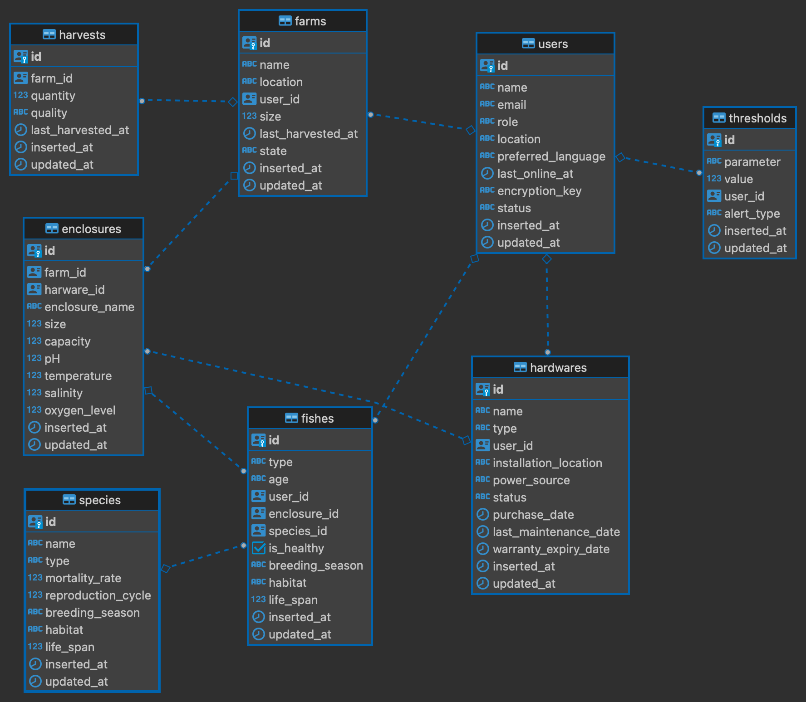
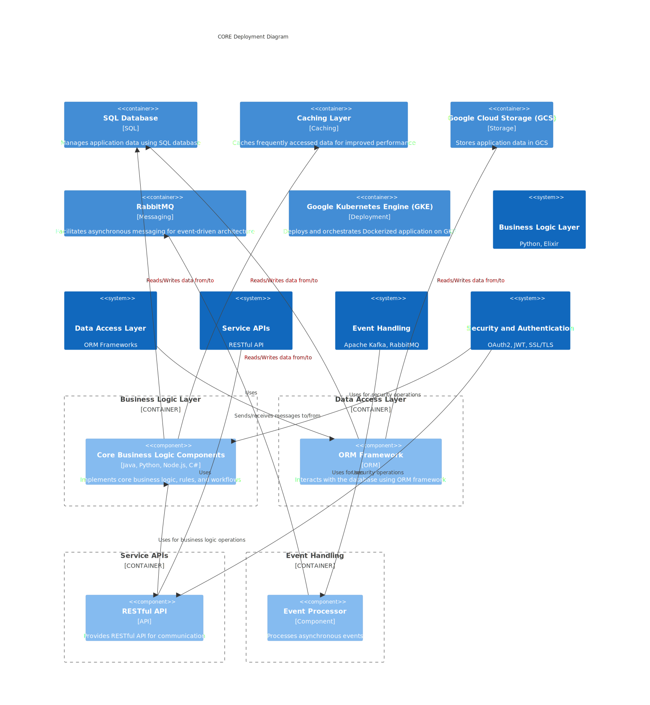
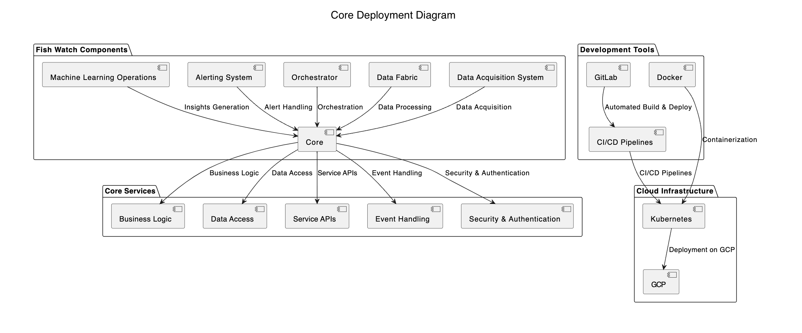

# Core Service for Fishy Watch

***Core Service*** is the central component responsible for housing the core application logic, business rules, data processing, and backend functionalities within the Fishy Watch system. It serves as the backbone of the system, orchestrating data flow, handling business operations, and ensuring overall system functionality.

## Entity Relationship Details
| Migration File                    | Description                                                                                                              | Indexes / Constraints                                             | Analytics / Inferences                                             |
| -------------------------------- | ------------------------------------------------------------------------------------------------------------------------ | ---------------------------------------------------------------- | ------------------------------------------------------------------- |
| ***UsersTable***               | A table to store user information including name, email, role, location, preferred language, and online status. | Unique index on user_id in farms table.                          | It enables user management and authentication functionalities. It uses for roles and language based UI rendering.|
| ***FarmsTable***               | A table to store farm details such as name, location, size, and last harvested date.                            | Unique index on farm_id in enclosures table.                     | It facilitates farm management and tracking of harvest data. |
| ***HarvestsTable***            | A table to record harvest details including farm_id, quantity, quality, and timestamp.                          | Unique index on farm_id in harvests table.                       | It supports tracking of harvest events and performance analysis. |
| ***HardwaresTable***           | A table to manage hardware devices used in the system, including name, type, installation location, etc.        | Unique index on user_id in hardwares table.                      | It enables tracking of hardware installations and maintenance. |
| ***EnlosuresTable***           | A table to store enclosure information such as size, capacity, and environmental metrics.                      | Unique indexes on farm_id and hardware_id in enclosures table.    | It facilitates monitoring of environmental conditions in enclosures. |
| ***SpeciesTable***             | A table to define various species of aquatic life, including mortality rate, reproduction cycle, etc.           | No unique indexes or constraints.                               | It supports management of different species and their characteristics. |
| ***ThresholdTable***           | A table to store user-defined thresholds for triggering alerts based on parameter values.                       | Unique index on user_id in thresholds table.                    | It enables customization of alert thresholds for user-specific monitoring. |

### ER Diagram

## Component Details

| Component Name  | Component Description | Technology Choices |
| ------------- | ------------- | ------------- |
| ***Business Logic Layer***  | Layer for implementing core business logic, domain-specific rules, workflows, data transformations, and processing algorithms to support Fishy Watch functionalities. | Python, Elixir |
| ***Data Access Layer***  | Layer for accessing and interacting with data stores, databases, external APIs, and data sources to retrieve, store, update, and manage data required by the Core Service. | ORM Frameworks, RESTful APIs, SQL Databases, Caching Layer (Redis) |
| ***Service APIs***  | APIs exposed by the Core Service for communication with other system components, external services, user interfaces, and integration points within the Fishy Watch ecosystem. | RESTful APIs |
| ***Event Handling***  | Component for handling asynchronous events, messaging, event-driven architecture patterns, and event processing within the Core Service for real-time updates and data synchronization. | RabbitMQ, Event-Driven Architecture |
| ***Security and Authentication***  | Security layer for implementing authentication, authorization, identity management, encryption, access control, and security policies to protect sensitive data and system resources. | OAuth2, JWT, SSL/TLS, Identity Providers |

### Component Diagram

## Architectural Characteristics

| Characteristics  | Decisions |
| ------------- | ------------- |
| Modularity  | Design the Core Service as a modular, decoupled architecture with well-defined boundaries, separation of concerns, and reusable components for scalability and maintainability. |
| Scalability  | Implement scalable architecture patterns such as microservices, distributed computing, horizontal scaling, and load balancing to handle growing system demands and user traffic. |
| Reliability  | Ensure high availability, fault tolerance, error handling, and recovery mechanisms within the Core Service to minimize downtime, data loss, and system failures. |
| Performance  | Optimize performance through efficient algorithms, caching strategies, database optimizations, asynchronous processing, and resource utilization monitoring for responsive system behavior. |

## Architectural Choice

- Microservices Architecture for modular, independent services, API-driven interactions, and agile development, deployment, and scaling of Core Service components.

## Deployment View
Below is the deployment view based on the architecture choice and this ADR [Deploy Core Service in cloud.md](../ADRs/014-deployment-strategy.md)

