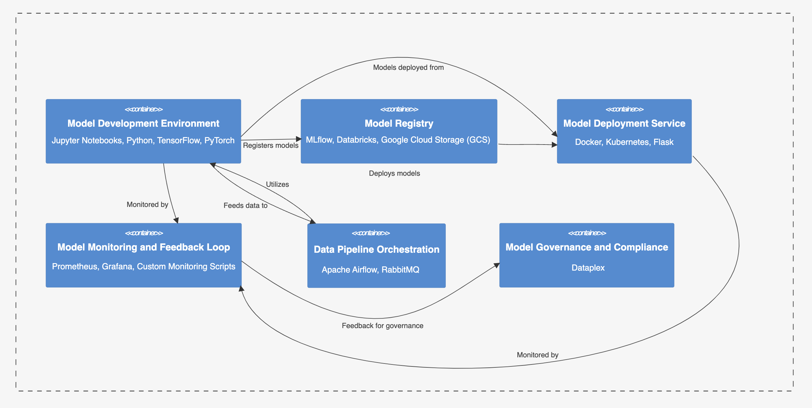
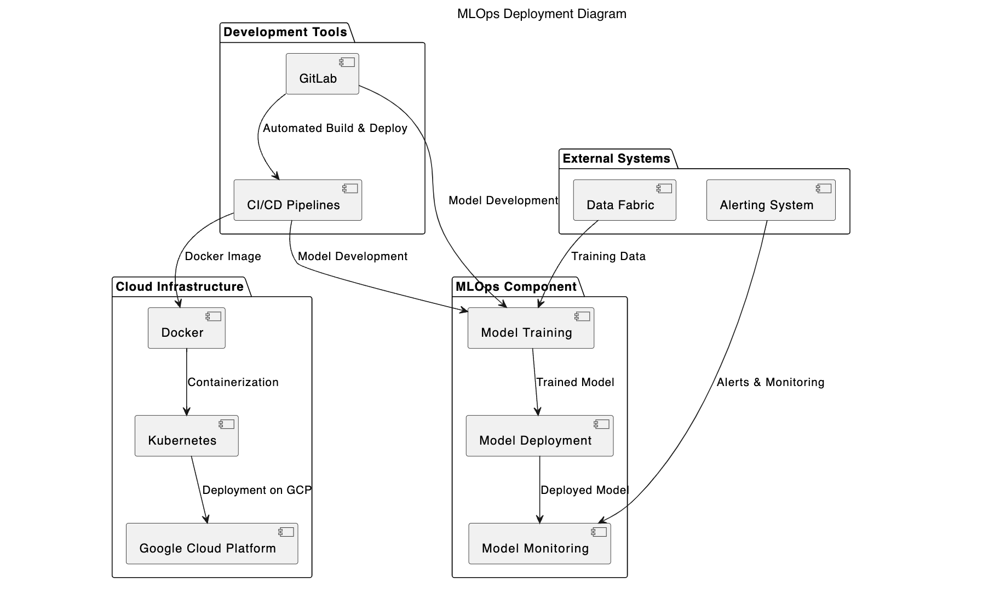

# ML Ops for Fishy Watch System

***ML Ops*** is the software system responsible for managing machine learning model development, deployment, monitoring, and optimization within the Fishy Watch system. It ensures the seamless integration of machine learning capabilities into operational workflows and decision-making processes.

## Component Details

| Component Name  | Component Description | Technology Choices |
| ------------- | ------------- | ------------- |
| ***Model Development Environment***  | Environment for data scientists to develop, train, and evaluate machine learning models using historical data, feature engineering, and model validation techniques. | Jupyter Notebooks, Python, TensorFlow, PyTorch |
| ***Model Registry***  | Centralized repository for storing trained machine learning models, version control, metadata management, and model lineage tracking. | MLflow, Databricks, Google Cloud Storage (GCS) |
| ***Model Deployment Service***  | Service responsible for deploying machine learning models into production, creating inference endpoints, managing model versions, and scaling prediction workloads. | Docker, Kubernetes, Flask |
| ***Model Monitoring and Feedback Loop***  | Continuous monitoring of deployed models, drift detection, performance metrics tracking, feedback collection from users and domain experts, and automated model retraining based on feedback and data changes. | Prometheus, Grafana, Custom Monitoring Scripts |
| ***Data Pipeline Orchestration***  | Orchestration layer for data ingestion, preprocessing, feature engineering, batch processing, and streaming data pipelines feeding into the model development and deployment workflows. | Apache Airflow, RabbitMQ |
| ***Model Governance and Compliance***  | Governance framework for managing access control, security policies, regulatory compliance, model explainability, and auditing of machine learning models and workflows. | Dataplex |

### Component Diagram

## Architectural Characteristics

| Characteristics  | Decisions |
| ------------- | ------------- |
| Scalability  | Architecture designed to scale horizontally for handling large volumes of data, model deployments, and prediction requests efficiently. |
| Reliability  | Implementation of fault-tolerant strategies, automated error recovery mechanisms, and high availability configurations to ensure reliable ML Ops workflows. |
| Automation  | Integration of automation tools and pipelines for seamless model deployment, monitoring, feedback collection, and retraining cycles. |
| Integration  | Seamless integration with existing data infrastructure, software systems, monitoring tools, and development environments for end-to-end ML Ops workflows. |

## Architectural Choice

- Microservices Architecture for scalability, flexibility, and independent development, deployment, and scaling of ML Ops components.

## Deployment View
Below is the deployment view based on the architecture choice and this ADR [Deploy ML Ops System in cloud.md](../ADRs/014-deployment-strategy.md)

