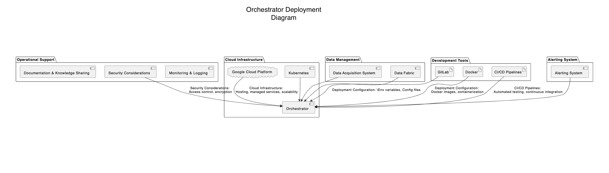

# Orchestrator System for Fishy Watch

***Orchestrator System*** is the central component responsible for facilitating communication, coordinating workflows, and orchestrating interactions between different systems within the Fishy Watch ecosystem, including Data Fabric, Core System, ML Ops, Data Acquisition, and others. It ensures seamless integration, data flow management, and workflow automation across the entire system.

## Component Details

| Component Name  | Component Description | Technology Choices |
| ------------- | ------------- | ------------- |
| ***Integration Layer***  | Layer for integrating and connecting various systems, services, APIs, and data sources within the Fishy Watch ecosystem, enabling data exchange, event triggering, and workflow initiation. | Rule-based architecture (inhouse) using DSLs and CodeExecutor |
| ***Workflow Orchestration Engine***  | Engine for defining, managing, and executing complex workflows, business processes, and data pipelines across different systems, ensuring proper sequencing, dependencies, and error handling. | Rule-based architecture (inhouse) using DSLs and CodeExecutor |
| ***Event Bus***  | Centralized event bus for event-driven communication, message routing, pub/sub messaging patterns, and asynchronous interactions between distributed components and systems. | RabbitMQ, Redis |
| ***API Gateway***  | Gateway for providing unified access, authentication, authorization, and API management capabilities to external systems, users, and third-party integrations interacting with the Orchestrator System. | Authentication Service, Ambassador |

### Component Diagram

## Architectural Characteristics

| Characteristics  | Decisions |
| ------------- | ------------- |
| Interoperability  | Implement interoperable protocols, standards, and data formats to facilitate seamless communication and integration between heterogeneous systems and technologies. |
| Workflow Automation  | Define automated workflows, data pipelines, and business processes using visual tools, declarative configurations, and workflow templates for efficient execution and management. |
| Scalability  | Design scalable orchestrator architecture to handle growing system complexity, increased data volumes, concurrent workflows, and distributed system interactions. |
| Fault Tolerance  | Implement fault-tolerant mechanisms, retry strategies, error handling, and recovery mechanisms to ensure system reliability, resilience, and continuity of operations. |

## Architectural Choice

- Service-Oriented Architecture (SOA) for modular, loosely coupled services, standardized interfaces, and reusable components supporting flexible integration and extensibility.

## Deployment View
Below is the deployment view based on the architecture choice and this ADR [Deploy Orchestrator System in cloud.md](../ADRs/014-deployment-strategy.md)

